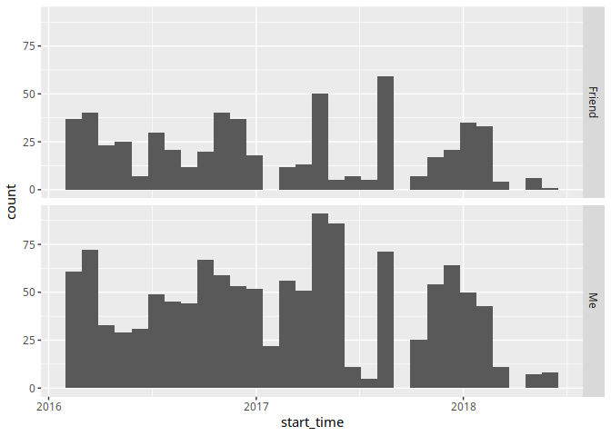

# CSGO Matches Analysis

To analyze your matches:

  - Go to your csgo competitive match history and save the html
    webpage\*
  - Run the scraper on the html (complete although strangely slow)
  - Run the R analysis on the resulting sqlite file (wip)

\* This [reddit
post](https://www.reddit.com/r/GlobalOffensive/comments/8mbtjx/how_to_check_your_personal_game_data_for_banned/)
contains a plugin for helping load all the matches. (from 3KliksPhillip)
[video](https://youtu.be/AJyemS9hl50))

### Running the Scrapper

``` bash
$ git clone https://github.com/BorisNikulin/csgo-matches-analyzer.git
$ cd ./csgo-matches-analyzer/data-scraper
$ stack build
$ stack exec scraper-exe -- --help
```

Note: The R analysis assumes the database is called `csgo.db` and is
located inside `./data-scraper`.

## Analysis (wip)

``` r
library(readr)
library(DBI)
library(lubridate)
library(dplyr)
library(glue)

vars <- read_csv('secrets/vars.csv',
    col_types = cols(col_character(), col_character())
    )
id1 <- vars$MY_ID
id2 <- vars$FRIEND_ID

# Sql with variable Interpolation utility func
# ifd why glue_sql doesnt work
# however it quotes interpolated variables which I dont want
si <- . %>% glue() %>% sql()

con <- dbConnect(RSQLite::SQLite(), './data-scraper/csgo.db')
```

``` r
library(ggplot2)

tbl(con, si("
    SELECT
        CASE p.steam_id
            WHEN {id2} THEN 'Friend'
            WHEN {id1} THEN 'Me'
        END AS 'name',
    pl.start_time
    FROM player p
    INNER JOIN played_in pl ON p.steam_id = pl.pid
    WHERE
        p.steam_id = {id2} OR
        p.steam_id = {id1}
    ")) %>%
    collect() %>%
    mutate(name = as.factor(name)) %>%
    mutate(start_time = ymd_hms(start_time)) %>%
    ggplot(aes(start_time)) +
    geom_histogram() +
    facet_grid(name~.)
```

<!-- -->
