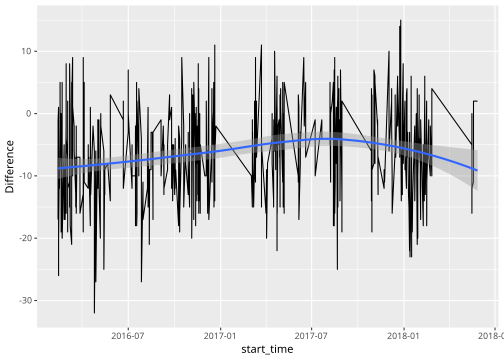

# CSGO Matches Analysis

To analyze your matches:

  - Go to your csgo competitive match history and save the html
    webpage\*
  - Run the scraper on the html (complete although strangely slow)
  - Run the R analysis on the resulting sqlite file (wip)

\* This [reddit
post](https://www.reddit.com/r/GlobalOffensive/comments/8mbtjx/how_to_check_your_personal_game_data_for_banned/)
contains a plugin for helping load all the matches. (from 3KliksPhillip)
[video](https://youtu.be/AJyemS9hl50))

### Running the Scrapper

``` bash
$ git clone https://github.com/BorisNikulin/csgo-matches-analyzer.git
$ cd ./csgo-matches-analyzer/data-scraper
$ stack build
$ stack exec scraper-exe -- --help
```

Note: The R analysis assumes the database is called `csgo.db` and is
located inside `data-scraper`.

## Analysis (wip)

``` r
library(readr)
library(DBI)
library(lubridate)
library(dplyr)
library(tidyr)
library(glue)

vars <- read_csv('secrets/vars.csv',
    col_types = cols(col_character(), col_character())
    )
id1 <- vars$MY_ID
id2 <- vars$FRIEND_ID
p.name <- glue("CASE WHEN p.steam_id = {id1} THEN 'Me' WHEN {id2} THEN 'Friend' END AS name")

# Sql with variable Interpolation utility func
# idk why glue_sql doesnt work
# however it quotes interpolated variables which i dont want
si <- . %>% glue() %>% sql()

con <- dbConnect(RSQLite::SQLite(), './data-scraper/csgo.db')
```

``` r
library(ggplot2)

tbl(con, si("
    SELECT {p.name}, pl.start_time
    FROM player p
    INNER JOIN played_in pl ON p.steam_id = pl.pid
    WHERE
        p.steam_id = {id2} OR
        p.steam_id = {id1}
    ")) %>%
    collect() %>%
    mutate(name = as.factor(name)) %>%
    mutate(start_time = ymd_hms(start_time)) %>%
    ggplot(aes(start_time)) +
    geom_histogram() +
    facet_grid(name~.)
```

<!-- -->

``` r
tbl(con, si("
    SELECT AVG(pl.kills) AS AvgDayKills, pl.start_time, {p.name}
    FROM player p
    INNER JOIN played_in pl ON p.steam_id = pl.pid
    WHERE
        p.steam_id = {id1} OR
        p.steam_id = {id2}
    GROUP BY p.steam_id, pl.start_time
    ")) %>%
    collect() %>%
    mutate(start_time = ymd_hms(start_time)) %>%
    ggplot(aes(start_time, AvgDayKills)) +
    geom_line() +
    geom_smooth() +
    facet_grid(name~.)
```

<!-- -->

``` r
tbl(con, si("
    SELECT pl1.start_time, (pl1.kills - pl2.kills) AS 'Difference'
    FROM player p1, player p2
    INNER JOIN played_in pl1 ON p1.steam_id = pl1.pid
    INNER JOIN played_in pl2 ON p2.steam_id = pl2.pid
    WHERE
      p1.steam_id = {id1} AND
      p2.steam_id = {id2} AND
      pl1.start_time = pl2.start_time AND
      pl1.map = pl2.map AND
      pl1.duration = pl2.duration
    GROUP BY pl1.start_time
    ")) %>%
    collect() %>%
    mutate(start_time = ymd_hms(start_time)) %>%
    ggplot(aes(start_time, Difference)) +
    geom_line() +
    geom_smooth()
```

<!-- -->

``` r
data_win_ratio_per_kill_map <- tbl(con, si("
    SELECT {p.name}, pl.kills, m.map, AVG(win.DidWin) AS WinRate, COUNT(win.DidWin) AS Weight
    FROM player p
    INNER JOIN played_in pl ON p.steam_id = pl.pid
    INNER JOIN match m ON
        pl.map = m.map AND
        pl.start_time = m.start_time AND
        pl.duration = m.duration
    INNER JOIN (
        SELECT p.steam_id, m.map, m.start_time, m.duration,
            CASE
                WHEN pl.team = 0 AND m.score_team_a = 16 THEN 1
                WHEN pl.team = 1 AND m.score_team_b = 16 THEN 1
                WHEN m.score_team_a = 16 OR m.score_team_b = 16 then 0
            END as DidWin
        FROM player p
        INNER JOIN played_in pl ON p.steam_id = pl.pid
        INNER JOIN match m ON
            pl.map = m.map AND
            pl.start_time = m.start_time AND
            pl.duration = m.duration
    ) win ON
        p.steam_id = win.steam_id AND
        m.map = win.map AND
        m.start_time = win.start_time AND
        m.duration = win.duration
    WHERE
        p.steam_id = {id1} OR
        p.steam_id = {id2}
    GROUP BY p.steam_id, pl.kills, m.map
    ")) %>%
    collect() %>%
    drop_na()

data_win_ratio_per_kill_map %>%
    add_count(name, map) %>%
    filter(n != 1) %>%
    ggplot(aes(kills, WinRate)) +
    geom_smooth() +
    geom_line() +
    facet_grid(name ~ map) +
    guides(alpha = FALSE)
```

<!-- -->

``` r
data_win_ratio_per_kill <- data_win_ratio_per_kill_map %>%
    group_by(name, kills) %>%
    summarise(
        WinRate = weighted.mean(WinRate, Weight),
        Weight = sum(Weight))

ggplot(data_win_ratio_per_kill, aes(kills, WinRate)) +
    geom_point() +
    geom_smooth() +
    geom_line() +
    facet_grid(name~.)
```

<!-- -->

Hypothesis: I do *better* when I play solo than when I play with my
friend. We will use a Welch’s t test to compare performance of the two
distributions. The variable we will consider is the score since it’s an
easy and comprehensive enough total score.

``` r
performance_solo <- tbl(con, si("
    SELECT pl1.kills, pl1.assists, pl1.deaths,
        pl1.mvps, pl1.hsp, pl1.score
    FROM player p1, player p2
    INNER JOIN played_in pl1 ON p1.steam_id = pl1.pid
    INNER JOIN played_in pl2 ON p2.steam_id = pl2.pid
    WHERE
      p1.steam_id = {id1} AND
      p2.steam_id <> {id2} AND
      pl1.start_time = pl2.start_time AND
      pl1.map = pl2.map AND
      pl1.duration = pl2.duration
    GROUP BY pl1.start_time
    ")) %>% collect()

performance_with_friend <- tbl(con, si("
    SELECT pl1.kills, pl1.assists, pl1.deaths,
        pl1.mvps, pl1.hsp, pl1.score
    FROM player p1, player p2
    INNER JOIN played_in pl1 ON p1.steam_id = pl1.pid
    INNER JOIN played_in pl2 ON p2.steam_id = pl2.pid
    WHERE
      p1.steam_id = {id1} AND
      p2.steam_id = {id2} AND
      pl1.start_time = pl2.start_time AND
      pl1.map = pl2.map AND
      pl1.duration = pl2.duration
    GROUP BY pl1.start_time
    ")) %>% collect()

for(i in 1:ncol(performance_solo))
{
    print(names(performance_solo)[i])
    print(t.test(performance_solo[[i]], performance_with_friend[[i]]))
}
```

    ## [1] "kills"
    ## 
    ##  Welch Two Sample t-test
    ## 
    ## data:  performance_solo[[i]] and performance_with_friend[[i]]
    ## t = 2.1919, df = 1182, p-value = 0.02858
    ## alternative hypothesis: true difference in means is not equal to 0
    ## 95 percent confidence interval:
    ##  0.06155057 1.11186481
    ## sample estimates:
    ## mean of x mean of y 
    ##  14.69440  14.10769 
    ## 
    ## [1] "assists"
    ## 
    ##  Welch Two Sample t-test
    ## 
    ## data:  performance_solo[[i]] and performance_with_friend[[i]]
    ## t = 0.64326, df = 1162.9, p-value = 0.5202
    ## alternative hypothesis: true difference in means is not equal to 0
    ## 95 percent confidence interval:
    ##  -0.1499608  0.2962582
    ## sample estimates:
    ## mean of x mean of y 
    ##  4.155200  4.082051 
    ## 
    ## [1] "deaths"
    ## 
    ##  Welch Two Sample t-test
    ## 
    ## data:  performance_solo[[i]] and performance_with_friend[[i]]
    ## t = 0.51272, df = 1109, p-value = 0.6082
    ## alternative hypothesis: true difference in means is not equal to 0
    ## 95 percent confidence interval:
    ##  -0.3547395  0.6057207
    ## sample estimates:
    ## mean of x mean of y 
    ##  17.92720  17.80171 
    ## 
    ## [1] "mvps"
    ## 
    ##  Welch Two Sample t-test
    ## 
    ## data:  performance_solo[[i]] and performance_with_friend[[i]]
    ## t = 0.9433, df = 929.84, p-value = 0.3458
    ## alternative hypothesis: true difference in means is not equal to 0
    ## 95 percent confidence interval:
    ##  -0.07337336  0.20918907
    ## sample estimates:
    ## mean of x mean of y 
    ##  2.285857  2.217949 
    ## 
    ## [1] "hsp"
    ## 
    ##  Welch Two Sample t-test
    ## 
    ## data:  performance_solo[[i]] and performance_with_friend[[i]]
    ## t = 1.5548, df = 1079.3, p-value = 0.1203
    ## alternative hypothesis: true difference in means is not equal to 0
    ## 95 percent confidence interval:
    ##  -0.3057205  2.6395169
    ## sample estimates:
    ## mean of x mean of y 
    ##  36.00081  34.83392 
    ## 
    ## [1] "score"
    ## 
    ##  Welch Two Sample t-test
    ## 
    ## data:  performance_solo[[i]] and performance_with_friend[[i]]
    ## t = 2.0185, df = 1172.4, p-value = 0.04377
    ## alternative hypothesis: true difference in means is not equal to 0
    ## 95 percent confidence interval:
    ##  0.03626767 2.55664857
    ## sample estimates:
    ## mean of x mean of y 
    ##  37.77680  36.48034
